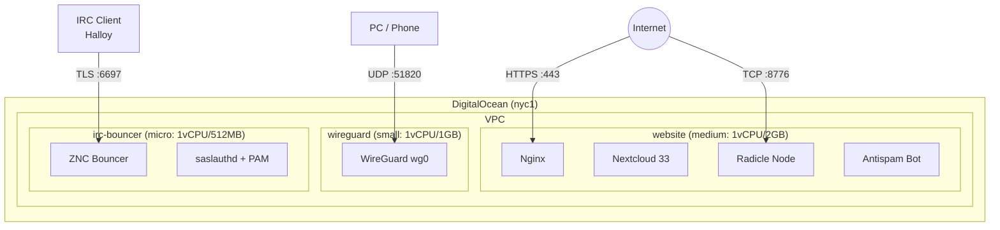
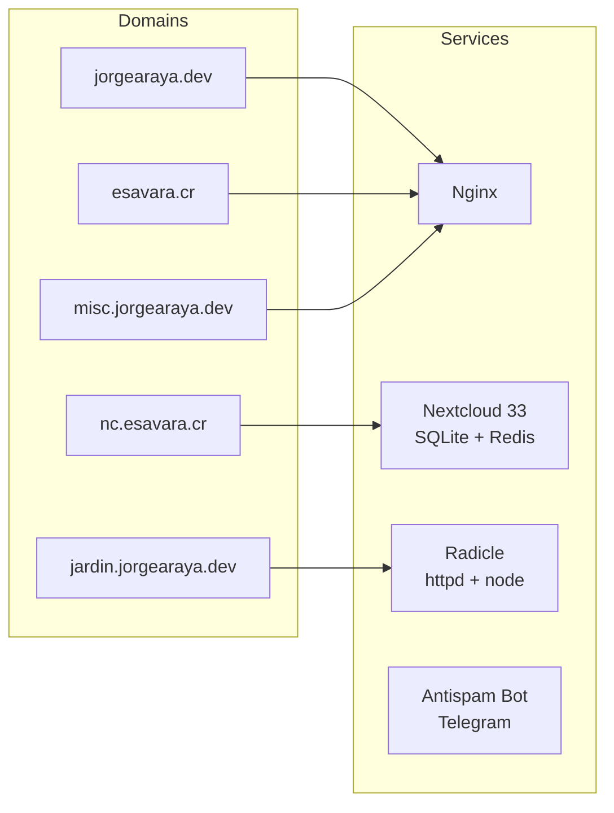
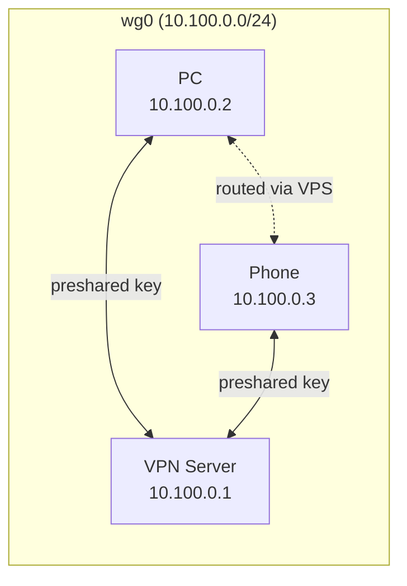

# jorgearaya.dev

This repository has my professional blog and the Nix files that configures the server on Digital Ocean.

## Infrastructure

All droplets run NixOS on DigitalOcean (nyc1 region), managed with Terraform (`IaC/`) and deployed with `deploy-rs`.



### Website Droplet (`vps.nix`)

Hosts the main web services behind Nginx with ACME certificates via DigitalOcean DNS.



### VPN Droplet (`vpn.nix`)

WireGuard VPN server with IP forwarding for routing between peers.



### ZNC Droplet (`znc.nix`)

IRC bouncer connecting to multiple networks. See [etc/notes/znc.md](etc/notes/znc.md) for details.

## Deployment

```sh
# Deploy a specific node
nix run github:serokell/deploy-rs .#site
nix run github:serokell/deploy-rs .#vpn
nix run github:serokell/deploy-rs .#znc
```

## Notes

How to make a new Digital Ocean image:

```sh
nix build .#digital-ocean
```

### Secrets

Secrets are provided with this repository and installed after Digital Ocean has created the droplet. They cannot be installed on the Digital Ocean image on creation (AFAIK) thus we need to ssh into the server and generate the AGE key from the public SSH key of the system.

```sh
$ nix-shell -p ssh-to-age --run 'cat /etc/ssh/ssh_host_ed25519_key.pub | ssh-to-age'
```

After getting the AGE key, we have to update `.sops.yaml` and run `sops updatekeys` for the `secrets.yaml` file.

### Terraform

Infrastructure is managed in `IaC/`:

```sh
cd IaC
terraform plan
terraform apply
```

### ZNC

See [etc/notes/znc.md](etc/notes/znc.md) for post-deploy setup and Halloy configuration.
